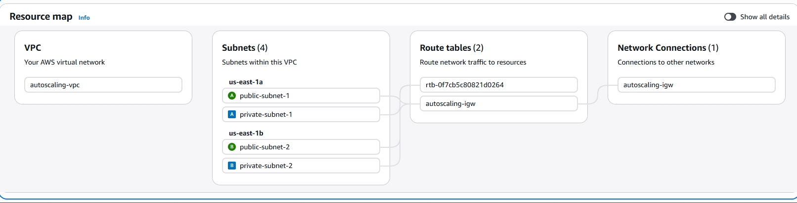
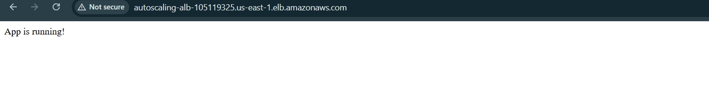
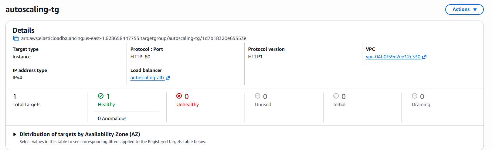
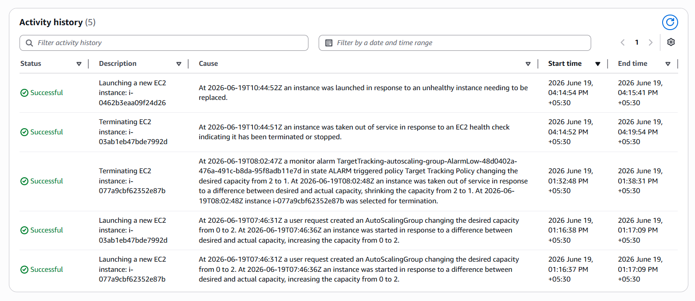
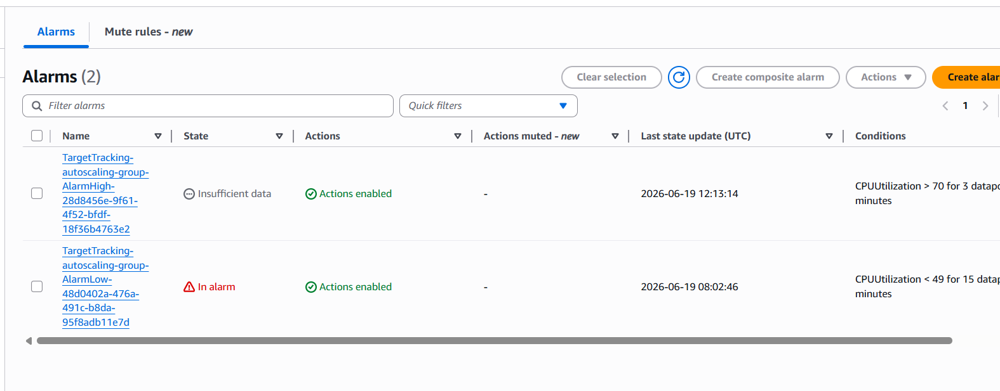

# AWS Auto Scaling Web App with Monitoring

A production-grade, highly available web application deployed on AWS using EC2 Auto Scaling, Application Load Balancer, and RDS MySQL — with real-time CloudWatch monitoring and automatic scaling based on CPU utilization.

---

## 🏗️ Architecture



```
Internet
    ↓
Application Load Balancer (autoscaling-alb)
    ↓
Auto Scaling Group (min: 1, desired: 2, max: 4)
    ├── EC2 Instance 1 — public-subnet-1 (us-east-1a)
    └── EC2 Instance 2 — public-subnet-2 (us-east-1b)
            ↓
    RDS MySQL (private subnet — not publicly accessible)
            ↓
    CloudWatch Alarms (CPU > 70% → scale up)
```

---

## 🛠️ AWS Services Used

| Service | Purpose |
|---|---|
| EC2 | Application servers running Dockerized Flask app |
| Auto Scaling Group | Automatically adds/removes EC2 instances based on CPU |
| Application Load Balancer | Distributes traffic across healthy EC2 instances |
| RDS MySQL | Managed relational database in private subnet |
| VPC | Isolated network with public and private subnets |
| CloudWatch | CPU monitoring and scaling alarms |
| Launch Template | Defines EC2 configuration for Auto Scaling |
| Docker | Containerized Flask application |
| Docker Hub | Container image registry |

---

## 📸 Project Screenshots

### App Running via Load Balancer


### Target Group — Healthy Instances


### Auto Scaling Activity History
Auto Scaling automatically launched and terminated instances based on CPU load and health checks.



### CloudWatch Alarms
- **AlarmHigh** — triggers scale UP when CPU > 70% for 3 datapoints
- **AlarmLow** — triggers scale DOWN when CPU < 49% for 15 datapoints



---

## ⚙️ How It Works

**1. Traffic Flow**
All traffic enters through the Application Load Balancer which distributes requests across healthy EC2 instances in two availability zones.

**2. Auto Scaling**
CloudWatch monitors CPU utilization every minute. When CPU exceeds 70%, a new EC2 instance is automatically launched. When CPU drops below 49%, excess instances are terminated to save cost.

**3. Health Checks**
The Load Balancer pings `/health` endpoint every 30 seconds. Unhealthy instances are automatically replaced by Auto Scaling.

**4. Database**
RDS MySQL runs in a private subnet — not accessible from the internet. Only EC2 instances inside the VPC can connect to it.

**5. Docker**
Each EC2 instance pulls the latest Flask app image from Docker Hub on startup via user data script — no manual deployment needed.

---

## 🔧 VPC Configuration

| Resource | Details |
|---|---|
| VPC CIDR | 10.0.0.0/16 |
| Public Subnet 1 | 10.0.1.0/24 — us-east-1a |
| Public Subnet 2 | 10.0.2.0/24 — us-east-1b |
| Private Subnet 1 | 10.0.3.0/24 — us-east-1a |
| Private Subnet 2 | 10.0.4.0/24 — us-east-1b |
| Internet Gateway | autoscaling-igw |

---

## 🚀 Auto Scaling Configuration

| Setting | Value |
|---|---|
| Minimum instances | 1 |
| Desired instances | 2 |
| Maximum instances | 4 |
| Scale up trigger | CPU > 70% |
| Scale down trigger | CPU < 49% |
| Health check type | ELB |

---

## 🐳 Flask Application

See [app.py](app.py) for full source code.

**Endpoints:**
- `/` — Returns "App is running!"
- `/health` — Returns health status (used by Load Balancer)
- `/db-test` — Tests RDS connectivity and returns database records

**Docker Image:** `saif0304/flask-app:latest`

---

## 💡 Key Concepts Demonstrated

**High Availability**
App runs across 2 availability zones — if one AZ goes down, traffic automatically routes to the other.

**Auto Scaling**
Infrastructure scales automatically based on real load — no manual intervention needed.

**Security**
RDS database placed in private subnet — never directly exposed to the internet. EC2 instances connect via internal VPC networking.

**Health-based Routing**
Load Balancer continuously checks instance health. Unhealthy instances receive no traffic and are automatically replaced.

**Infrastructure as User Data**
EC2 instances are fully configured on launch via user data script — pulls Docker image and starts the app automatically.

---

## 📚 What I Learned

- Designing multi-AZ VPC architecture from scratch
- Configuring Application Load Balancers with health checks
- Setting up Auto Scaling Groups with target tracking policies
- Deploying RDS in private subnets with proper security groups
- Troubleshooting EC2 connectivity and Docker container issues
- How CloudWatch alarms trigger scaling events automatically
- The difference between scale-up and scale-down policies

---

## 👤 Author

**Saif Attar**
- LinkedIn: [linkedin.com/in/saif-attar-b15775346](https://linkedin.com/in/saif-attar-b15775346)
- GitHub: [github.com/SaifAttar003](https://github.com/SaifAttar003)
